# job4j_dreamjob

### Описание

Данное веб-приложение представляет собой биржу вакансий. В нём предоставляется возможность добавлять вакансии и 
кандидатов. Для работы в системе необходимо зарегистрироваться, а затем авторизоваться.

---

Первое, что мы видим при попытке пользования системой - окно авторизации:

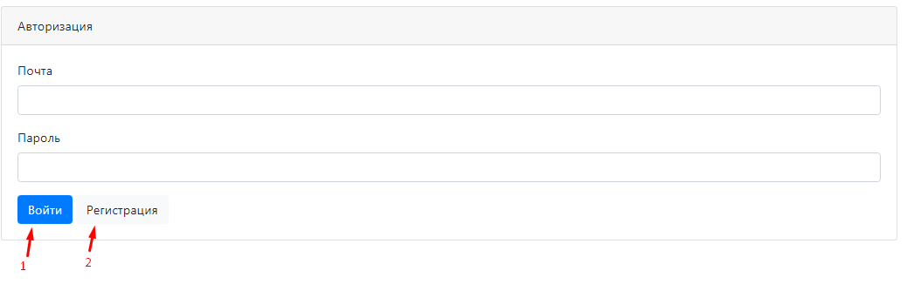

1. Кнопка для входа в систему
2. Кнопка для перехода на страницу регистрации

---

При попытке войти без введённой электронной почты, будет выдано сообщение:

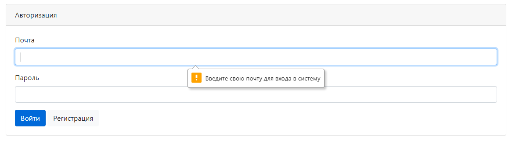

---

Перейдем на страницу регистрации:

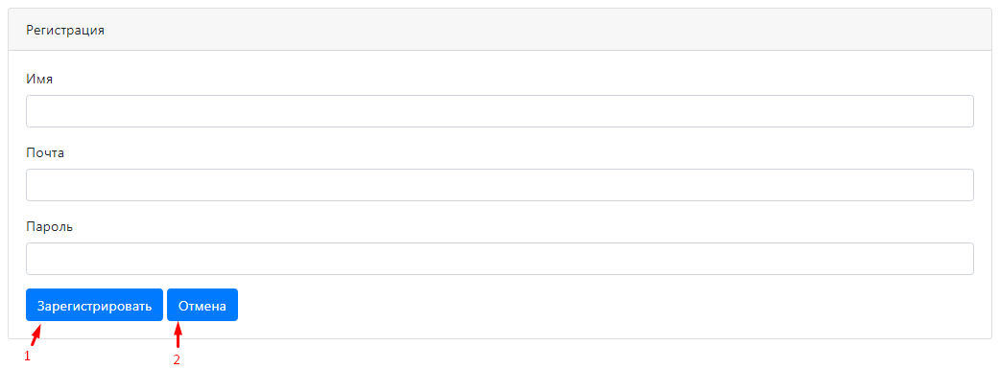

1. Кнопка для регистрации в системе
2. Вернуться назад на страницу авторизации

---

При попытке зарегистрироваться без введённой электронной почты, будет выдано сообщение:

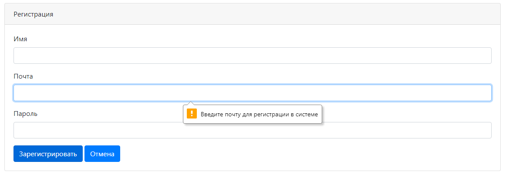

---

Заполним данные нового пользователя в системе:

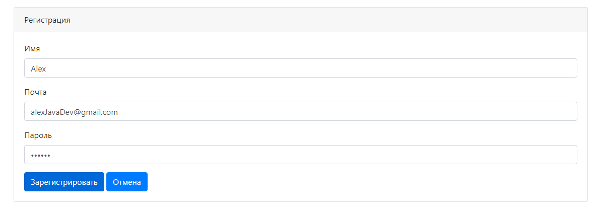

И нажмем на кнопку "Зарегистрировать"

---

Нас перекинет на страницу авторизации с предварительно заполненными данными:

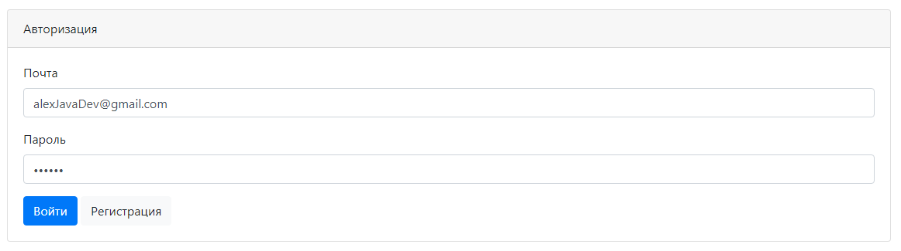

Войдем в систему.

---

После входа в систему мы попадаем на основную страницу веб-приложения:

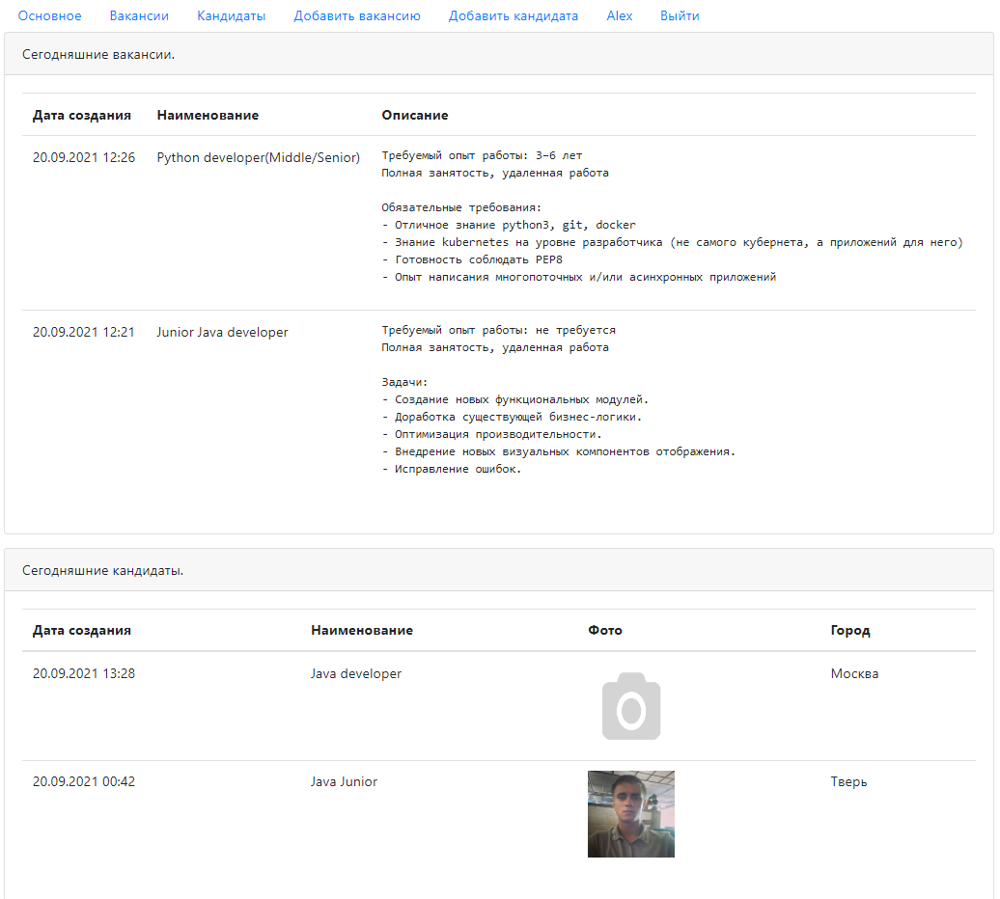

В самом верху страницы мы можем видеть панель навигации данной системы. А данный момент мы находимся в разделе "Основное".
Ниже панели навигации видны вакансии и кандидаты, которые были добавлены за последние сутки в порядке упорядочивания по дате 
создания. Более "свежие" выше в списке.

---

Перейдем на страницу вакансий, через кнопку "Вакансии" на панели навигации:

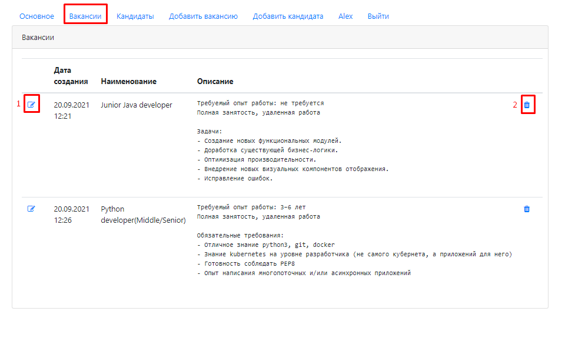

На данной странице мы можем редактировать и удалять существующие вакансий. Тут выводится весь список вакансий за весь 
период.

1. Редактирование текущей вакансии.
2. Удаление текущей вакансии.

---

Перейдем на страницу кандидатов, через кнопку "Кандидаты" на панели навигации:

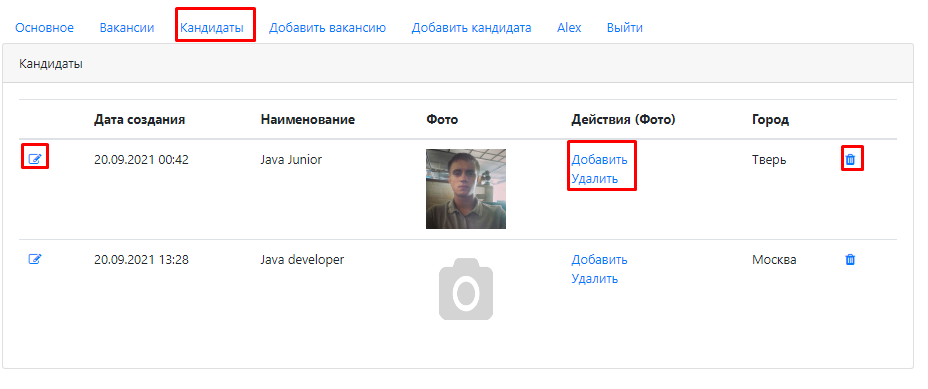

На данной странице мы можем также редактировать и удалять, но уже кандидатов. Тут выводится весь список кандидатов за 
весь период.

По аналогии с вакансиями, для редактирования и удаления текущего кандидата имеются соответствующие кнопки.

Для работы с фотографиями кандидатов имеются кнопки добавления и удаления. Кликнем по кнопке "Добавить" у второго
кандидата.

---

Нас перекинет на страницу загрузки фото:

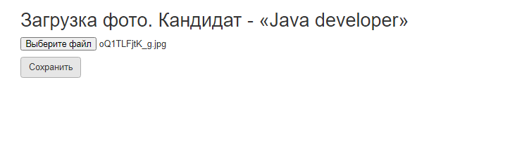

Выберем фото и кликнем по кнопке "Сохранить"

---

Нас вернёт обратно в список кандидатов:

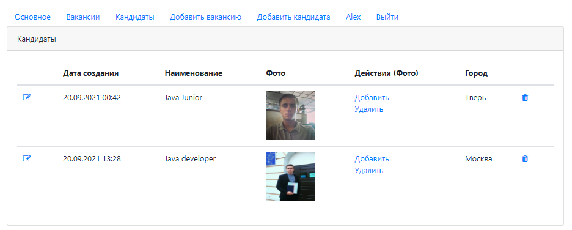

---

Перейдем на страницу добавления вакансии, через кнопку "Добавить вакансию" на панели навигации:

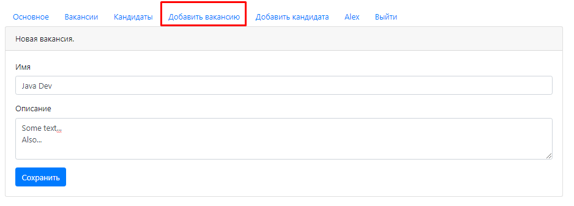

Здесь необходимо заполнить два поля. Имя вакансии и описание. После чего кликнув по кнопке "Сохранить", добавится новая 
вакансия.

Также через кнопку редактирования в списке вакансий мы попадем в похожее окно. В таком случае при нажатии на кнопку 
"Сохранить" будет отредактирована редактируемая вакансия.

---

Перейдем на страницу добавления кандидата, через кнопку "Добавить кандидата" на панели навигации:

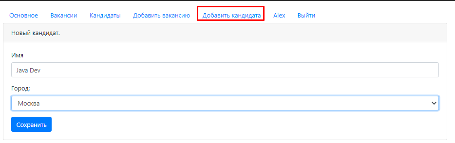

Здесь необходимо заполнить одно поле. Имя вакансии. А город выбрать из выпадающего списка. После чего кликнув по кнопке 
"Сохранить", добавится новый кандидат.

Также через кнопку редактирования в списке кандидатов мы попадем в похожее окно. В таком случае при нажатии на кнопку
"Сохранить" будет отредактирована редактируемый кандидат.

---

Выйти из системы за текущего пользователя можно, кликнув на кнопку "Выйти" в панели навигации:

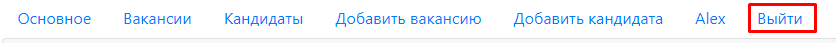